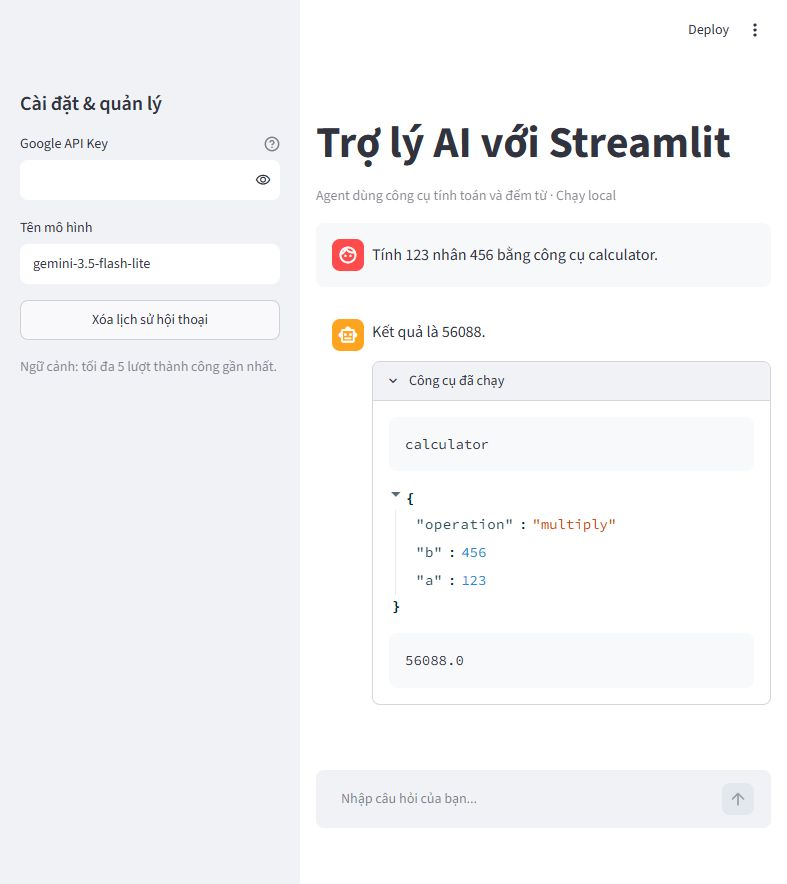
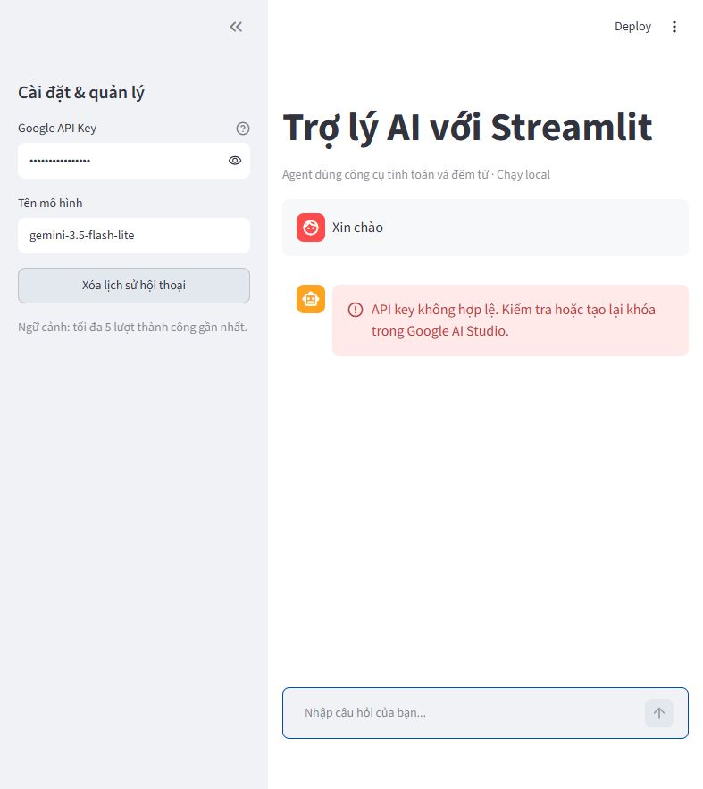

# Agent Streamlit — giao diện chat chạy local

Mã nguồn cho bài **Đóng gói Agent đơn giản thành giao diện chat local với Streamlit** trong chuỗi **AI Guru x TiniX**. Dự án dùng lại hai công cụ `calculator` và `count_words` của bài `Agent_tool`, rồi thêm ô nhập, lịch sử hội thoại, nút xóa và vùng hiển thị lỗi bằng Streamlit.

Repository: [minquanle/Agent_Streamlit](https://github.com/minquanle/Agent_Streamlit).

Ứng dụng chạy trên máy của bạn; các yêu cầu mô hình được gửi đến Gemini qua Internet. “Local” không có nghĩa là mô hình chạy ngoại tuyến.



## 1. Chuẩn bị

- Python **3.11.x**, Terminal và trình duyệt.
- Git để clone repository; nếu chưa cài Git, có thể tải **Code → Download ZIP** trên GitHub và giải nén.
- Kết nối Internet và Google API Key có quyền gọi mô hình hỗ trợ Tool Calling. Tạo hoặc quản lý key tại [Google AI Studio](https://aistudio.google.com/apikey).

Bốn phiên bản thư viện trực tiếp được ghim trong `requirements.txt`. Pip cài thêm các phụ thuộc của chúng. Khả năng gọi mô hình còn phụ thuộc tài khoản, quota và dịch vụ API.

## 2. Clone dự án

```bash
git clone https://github.com/minquanle/Agent_Streamlit.git
cd Agent_Streamlit
```

Nếu tải ZIP, mở Terminal trong thư mục đã giải nén chứa `app.py` và `requirements.txt`.

## 3. Tạo môi trường và cài thư viện

### Windows — PowerShell

```powershell
py -3.11 -m venv .venv
.\.venv\Scripts\Activate.ps1
python --version
python -m pip install -r requirements.txt
python -m pip check
Copy-Item .env.example .env
```

Kiểm tra `python --version` hiển thị Python 3.11.x. Nếu PowerShell chặn `Activate.ps1`, dùng trực tiếp `.\.venv\Scripts\python.exe` thay `python` trong các lệnh tiếp theo; cách này không cần đổi chính sách PowerShell. Lệnh sao chép `.env` dành cho lần thiết lập đầu tiên; nếu file đã có key, chỉnh file đó thay vì ghi đè.

### macOS / Linux

```bash
python3.11 -m venv .venv
source .venv/bin/activate
python --version
python -m pip install -r requirements.txt
python -m pip check
cp .env.example .env
```

Kết quả mong đợi của `pip check` là `No broken requirements found.` Lệnh này kiểm tra các quan hệ phụ thuộc đã khai báo, chưa kiểm tra kết nối API hoặc toàn bộ hành vi của app.

## 4. Cấu hình API

Mở `.env` cạnh `app.py` và thay giá trị mẫu bằng key của bạn:

```dotenv
GOOGLE_API_KEY=your_google_api_key_here
GEMINI_MODEL=gemini-3.5-flash-lite
DEBUG=false
```

- Ô **Google API Key** trong sidebar được ưu tiên nếu có giá trị; để trống để dùng `GOOGLE_API_KEY` từ môi trường.
- App đọc `.env` với `override=False`, nên biến môi trường có sẵn được ưu tiên hơn giá trị trong file.
- Có thể đổi tên mô hình ở sidebar hoặc `GEMINI_MODEL`. Nếu model không truy cập được, đối chiếu [danh sách Gemini](https://ai.google.dev/gemini-api/docs/models) và chọn model hỗ trợ Tool Calling mà tài khoản của bạn dùng được.
- Sau khi sửa `.env`, dừng rồi khởi động lại server. Giữ `DEBUG=false` khi dùng bình thường; bật `true` và khởi động lại khi cần xem traceback local.

`.gitignore` bỏ qua `.env`, venv và các kết quả kiểm thử được sinh ra. Không commit key thật hoặc `.streamlit/secrets.toml`. Ô password chỉ che ký tự trên màn hình; các lượt gọi API vẫn sử dụng quota và có thể phát sinh chi phí theo tài khoản.

## 5. Kiểm tra cục bộ và chạy app

Từ thư mục gốc của repository:

```bash
python -m py_compile app.py agent_core.py smoke_test.py
python smoke_test.py
python -m streamlit run app.py --server.address 127.0.0.1
```

Hai dòng mong đợi từ smoke test:

```text
PASS: 123*456=56088; đếm 4 từ; chia 0 trả thông báo lỗi.
PASS: giữ 5 lượt thành công; bỏ lượt lỗi; câu mới có đúng một lần.
```

Mở [http://127.0.0.1:8501](http://127.0.0.1:8501). Giữ Terminal chạy trong lúc sử dụng. Dừng server bằng **Ctrl+C**. Nếu cổng đã được dùng, thêm `--server.port 8502` vào lệnh và mở URL với cổng 8502.

## 6. Thử từng thành phần giao diện

Các giá trị dưới đây là kết quả mong đợi cho ví dụ. Đối chiếu câu trả lời với nhật ký **Công cụ đã chạy**; prompt không bảo đảm mô hình luôn chọn công cụ hoặc diễn đạt đúng kết quả.

| Thành phần | Cách kiểm tra |
| --- | --- |
| Ô nhập và calculator | Gửi `Tính 123 nhân 456 bằng công cụ calculator.`. Đối chiếu kết quả `56088` với tool `calculator`, operation `multiply` và kết quả tool `56088.0`. |
| count_words | Gửi `Đếm số từ trong câu 'Hoc AI rat vui' bằng count_words.`. Giá trị mong đợi là 4 theo cách tách khoảng trắng. |
| Lịch sử hội thoại | Xóa lịch sử, gửi `Tôi tên là Quân, làm kỹ sư phần mềm.`, rồi hỏi `Tôi tên gì và làm nghề gì?`. Kiểm tra phản hồi có dùng thông tin lượt trước. |
| Rerun | Đổi ô tên mô hình rồi đưa về giá trị cũ, kiểm tra các lượt còn trên UI. Thao tác này không gửi một câu hỏi mới. |
| Nút xóa | Nhấn **Xóa lịch sử hội thoại** và kiểm tra tin nhắn, log tool, lỗi cũ đã được bỏ khỏi UI. Code không gửi lại các lượt đã xóa; vẫn cần kiểm tra phản hồi mới có suy đoán thông tin cá nhân hay không. |
| Vùng lỗi | Nhập `invalid-test-key` ở sidebar rồi gửi câu hỏi. Kiểm tra thông báo khi API từ chối; bỏ key thử để dùng lại cấu hình hợp lệ. |



Để thử **thiếu key**, dừng server trước. Trên PowerShell:

```powershell
Rename-Item .env .env.saved
Remove-Item Env:GOOGLE_API_KEY -ErrorAction SilentlyContinue
$env:DEBUG = "true"
python -m streamlit run app.py --server.address 127.0.0.1
```

Để trống ô key và gửi `Xin chào`; kiểm tra thông báo **Chưa có Google API Key** cùng mục chi tiết lỗi. Dừng server và khôi phục sau phép thử:

```powershell
Rename-Item .env.saved .env
Remove-Item Env:DEBUG -ErrorAction SilentlyContinue
python -m streamlit run app.py --server.address 127.0.0.1
```

Nếu `.env` đã đặt `DEBUG=true`, đổi lại thành `false` trước khi chạy. Trên macOS/Linux, dùng `mv .env .env.saved`, `unset GOOGLE_API_KEY`, `export DEBUG=true`; sau phép thử, dùng `mv .env.saved .env` và `unset DEBUG`. Chỉ đổi tên `.env` trong lúc server đang chạy chưa đủ, vì key có thể đã được nạp vào môi trường của tiến trình.

## 7. Kiểm thử không gọi API

```bash
python tests/check_agent_loop.py
python tests/check_ui.py
```

- `smoke_test.py`: phép nhân, đếm theo khoảng trắng, chia cho 0 và cắt lịch sử theo cặp hỏi–đáp.
- `tests/check_agent_loop.py`: mô hình mô phỏng, công cụ Python thật; kiểm tra nhiều tool, `tool_call_id`, phản hồi rỗng và giới hạn 5 lần gọi.
- `tests/check_ui.py`: Streamlit AppTest với API mô phỏng; kiểm tra thiếu key, lỗi qua rerun, xóa, tránh gửi lại câu hỏi khi rerun, phục hồi sau lỗi và dữ liệu giữa các phiên.

Kết quả JSON nằm trong `tests/results/`, được bỏ qua bởi Git. Các kiểm tra này không chứng minh kết nối Gemini hoạt động; dùng các kịch bản trên trình duyệt để kiểm tra API với key của bạn. AppTest có thể in cảnh báo `missing ScriptRunContext` khi chạy ngoài server; cần đọc các dòng `PASS` và mã thoát của script.

## 8. Cấu trúc mã nguồn

```text
Agent_Streamlit/
├── app.py                       # Giao diện, Session State và xử lý lỗi
├── agent_core.py                # Hai tool và vòng lặp Agent
├── smoke_test.py                 # Kiểm tra cục bộ
├── requirements.txt             # Bốn phụ thuộc trực tiếp
├── .env.example                 # Cấu hình mẫu, không có key thật
├── .gitignore
├── .streamlit/config.toml       # Theme sáng, tắt thống kê sử dụng
├── README.md
├── tests/
│   ├── check_agent_loop.py
│   └── check_ui.py
└── docs/images/                 # Ảnh minh họa dùng trong README
```

Luồng xử lý: nhận câu hỏi → ghép tối đa 5 cặp hỏi–đáp thành công gần nhất → gọi mô hình → thực thi các tool được yêu cầu → gửi `ToolMessage` → lưu câu trả lời hoặc lỗi vào Session State → rerun để hiển thị.

## 9. Giới hạn của ví dụ

- UI giữ hội thoại trong phiên kết nối; refresh, mở tab mới hoặc restart server có thể mất lịch sử. Chưa có đăng nhập hay lưu hội thoại bền vững.
- Chỉ tối đa 5 cặp hỏi–đáp thành công được gửi lại; lượt lỗi không được gửi vào ngữ cảnh. Đây là giới hạn theo lượt, không phải giới hạn token.
- Vòng lặp có tối đa 5 lần gọi mô hình; timeout cấu hình 30 giây mỗi lần, `max_retries=0`. Tổng thời gian còn phụ thuộc số lần gọi và thực thi tool.
- `count_words` dùng `text.split()`, không phải thuật toán tách từ tiếng Việt. `calculator` dùng số thực Python, có giới hạn về độ chính xác và chỉ hỗ trợ bốn phép toán.
- Phân loại lỗi API dựa trên chuỗi trong thông báo ngoại lệ; thông báo khác có thể rơi vào nhánh lỗi chung.
- DEBUG thay các chuỗi key đã biết bằng ký hiệu che, chưa phải bộ lọc mọi dữ liệu nhạy cảm. Xem traceback trên máy local và kiểm tra trước khi chia sẻ.
- Đây là khung thực hành local. Nếu phát triển thành dịch vụ cho nhiều người dùng, cần thiết kế và kiểm thử thêm xác thực, phân quyền, lưu trữ và vận hành.

## 10. Lỗi thường gặp

| Triệu chứng | Hướng xử lý |
| --- | --- |
| Không kích hoạt được venv | Dùng Python trực tiếp trong `.venv/Scripts/python.exe` trên Windows. |
| `ModuleNotFoundError` | Cài lại bằng Python của venv với `python -m pip install -r requirements.txt`; kiểm tra đang ở thư mục dự án. |
| Không tìm thấy `app.py` | Chuyển vào thư mục clone `Agent_Streamlit` trước khi chạy. |
| Thiếu key dù có `.env.example` | Tạo `.env` cạnh `app.py`, thay key mẫu; tránh tên `.env.txt`. |
| Key không hợp lệ | Bỏ key thử trong sidebar hoặc tạo/cấu hình lại key; thay tên model không sửa key sai. |
| Model không truy cập được | Kiểm tra tên model, quyền của tài khoản và danh sách model chính thức. |
| 429 / giới hạn tốc độ hoặc quota | Kiểm tra hạn mức, tần suất và tài khoản; gửi lại khi API cho phép. |
| Đổi `.env` nhưng app dùng giá trị cũ | Khởi động lại server và kiểm tra biến môi trường có sẵn. |
| Mất lịch sử sau refresh | Phiên kết nối có thể đã được tạo lại; cần bổ sung lưu trữ nếu muốn giữ bền vững. |

## Tài liệu tham khảo

- [Streamlit: xây ứng dụng chat](https://docs.streamlit.io/develop/tutorials/llms/build-conversational-apps)
- [Streamlit: Session State](https://docs.streamlit.io/develop/api-reference/caching-and-state/st.session_state)
- [Streamlit: AppTest](https://docs.streamlit.io/develop/api-reference/app-testing)
- [LangChain: ChatGoogleGenerativeAI](https://docs.langchain.com/oss/python/integrations/chat/google_generative_ai)
- [Google: danh sách Gemini](https://ai.google.dev/gemini-api/docs/models)
- [python-dotenv](https://pypi.org/project/python-dotenv/)
